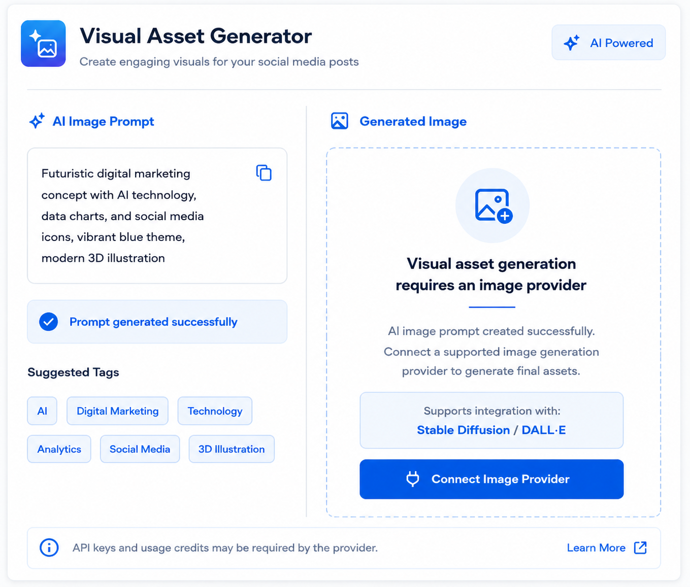

# EchoSocial AI 🤖✨

An AI-powered social media assistant that helps creators generate content ideas, analyze trends, create engaging posts, summarize news, and manage content workflows using intelligent automation.

---

## 🚀 Features

### ✍️ AI Content Generation
- Generate creative social media posts
- Create content ideas based on topics and trends
- AI-powered writing assistance

### 📈 Trend Analysis
- Discover trending topics
- Analyze current trends
- Generate content strategies

### 📰 News Summarization
- Summarize long news articles
- Convert information into social-media-friendly content

### 📅 Content Scheduling
- Schedule posts
- Manage planned content

### 📊 Analytics Dashboard
- Track content activity
- View generated posts and statistics

### 🎨 Image Studio
- Image generation interface implemented
- AI image generation API integration in progress

---

## 🛠️ Tech Stack

### Backend
- Python
- FastAPI
- SQLite
- Google Gemini API

### Frontend
- HTML5
- CSS3
- JavaScript

### Tools
- Git & GitHub
- VS Code

---
## 📂 Project Structure
EchoSocial/
│
├── frontend/ # Frontend UI files
│ ├── HTML pages
│ ├── CSS styles
│ └── JavaScript files
│
├── main.py # FastAPI backend server
├── models.py # Database models
├── database.py # Database configuration
├── requirements.txt # Python dependencies
└── .gitignore

### Image Studio



---

## ⚙️ Installation

Clone the repository:

```bash
git clone https://github.com/chandana-17c/EchoSocial.git